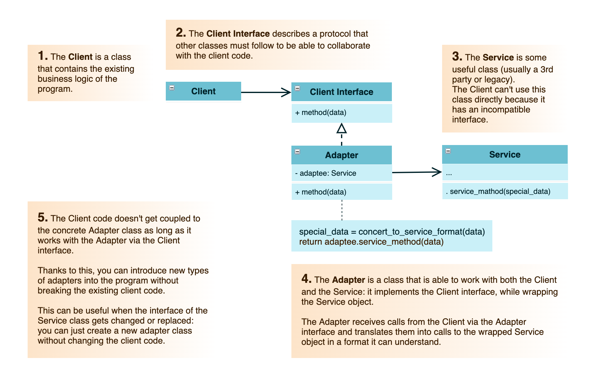

# Design Patterns: Adapter

This structural pattern allows objects with __incompatible interfaces to collaborate__:

1. The adapter sets an interface, compatible with one of the existing objects.
2. Using this interface, the object can safely call the adapter's methods.
3. Upon receiving a call, the adapter passes the request to the second object, but in a format and ordered as the second objects expects.

It is even possible to create a two-ways adapter that can convert the calls in both directions.

### Structure of an Adapter

